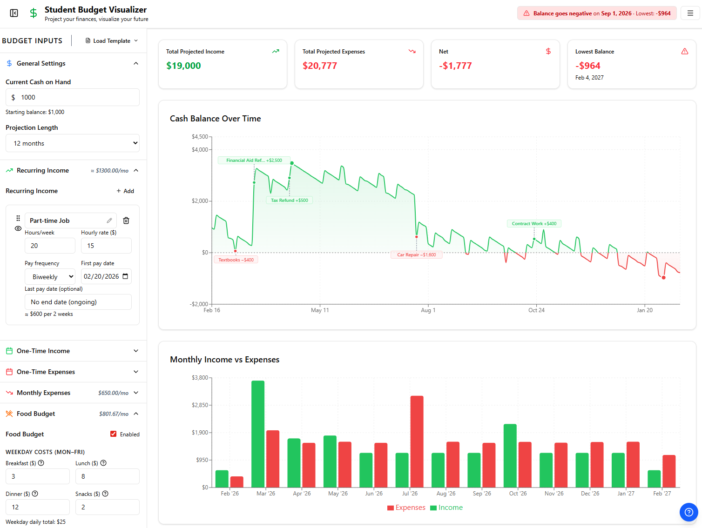

# Student Budget Visualizer
### *This is a work in progress and should not be used for actual financial decisions without double checking projections.*

A visual budget planning tool designed for students, or anyone, to track income, expenses, and project their financial future. See your cash balance fluctuate over time with interactive charts and get warnings before you run out of money.

> [!TIP]
> **View the live site here: [jwidess.github.io/student-budget-visualizer](https://jwidess.github.io/student-budget-visualizer)**

     



## Features

### 💰 Income Tracking
- **Recurring Income**: Full or part time job with configurable hours, hourly rate, and pay frequency (weekly/biweekly/monthly)
- **One-Time Income**: Tax refunds, stipends, gifts, and other non-recurring income

### 💸 Expense Management
- **Monthly Expenses**: Rent, utilities, subscriptions, loans, etc. with automatic monthly recurrence
- **One-Time Expenses**: Tuition payments, textbooks, electronics
- **Food Budget**: Separate weekday meal costs (breakfast/lunch/dinner/snacks) and weekend daily totals
- **Commuting Costs**: 
  - Auto transit with miles driven, MPG, and fuel cost calculations
  - Public transit with weekly pass cost

### 📊 Visual Projections
- **Cash Balance Over Time Chart**: Interactive time-series chart showing daily balance over your projection period
- **Monthly Income vs Expenses Chart**: Monthly aggregated bar chart comparing total income and expenses
- **Warning System**: Header banner alerts you when projections show negative balance, invalid dates, or other issues

### 💾 Data Persistence
- All data automatically saved to browser localStorage
- Import/export you input data in JSON format
- No account needed, no server required, runs entirely in your browser
- Reset to defaults with one click

## Example Video:
<video src="https://github.com/user-attachments/assets/943a29f3-b36c-480e-9549-e2a5b2e5642f"></video>

## Usage Tips

1. **Help Button**: Click the blue help button (bottom-right corner) for a full guide
2. **Templates**: Start with one of the templates to see how everything works ("Load Template" Button)
3. **Start Simple**: Begin with just your initial balance and one income source
4. **Add Expenses Gradually**: Start with big recurring costs (rent, utilities), then fill in details
5. **Use Drag Handles**: Reorder items by grabbing the grip icon (⋮⋮) on the left of each card
6. **Enable/Disable Items**: Click the eye icon to toggle whether an income or expense is included in projections without deleting it
7. **Multiple Sections Open**: Click any section header to expand/collapse
8. **Projection Length**: Adjust how many months ahead to calculate (3-24 months)
9. **Watch the Warning Banner**: The header shows an alert if your balance will go negative or if dates are invalid
10. **Help Tooltips**: Hover over help icons (?) next to input fields for explanations
11. **Reset**: Use the reset button in the settings menu to restore default values
12. **Import/Export**: Use the buttons in the settings menu to save your data as JSON or load it back in

## How It Works

The app runs a **day-by-day financial simulation** starting from your current balance:

1. **Input Configuration**: Enter your starting balance, income sources, and all expenses
2. **Projection Engine**: The engine (`src/engine/projection.ts`) simulates each day:
   - Adds recurring income on calculated paydays (weekly/biweekly/monthly)
   - Adds one-time income on specified dates
   - Subtracts recurring expenses on the specified day of each month
   - Subtracts one-time expenses on specified dates
   - Calculates daily food costs (weekday meals + weekend totals)
   - Calculates daily commuting costs (fuel for miles driven + prorated public transit)
3. **Balance Tracking**: Each day's ending balance becomes the next day's starting balance
4. **Danger Detection**: Identifies the first day (if any) when balance goes negative
5. **Chart Rendering**: Recharts visualizes the daily snapshots with smart sampling for performance

The entire state is managed by **Zustand** with localStorage persistence, so your budget survives browser refreshes.

## Tech Stack

- **React 19** + **TypeScript** - Type-safe component architecture
- **Vite 7** - Dev server and build tool
- **Tailwind CSS 4** - Styling with CSS variables for theming
- **Recharts 3** - Charting library for React
- **Zustand 5** - Lightweight state management
- **Radix UI** - Component primitives (Dialog, Tooltip)
- **dnd-kit** - Drag-and-drop toolkit
- **date-fns** - Date utility library
- **Lucide React** - Icon set

## Local Setup Instructions

### Prerequisites

You need **Node.js** and **npm** installed.

#### Check if you have Node.js:
```bash
node --version
npm --version
```

If not installed:
- **Windows**: Download from [nodejs.org](https://nodejs.org/) and run the installer
- **Linux**: Use your package manager

### Installation

#### Windows (PowerShell or Command Prompt)

1. **Clone the repository**:
   ```powershell
   git clone https://github.com/jwidess/student-budget-visualizer.git
   cd student-budget-visualizer
   ```

2. **Install dependencies**:
   ```powershell
   npm install
   ```

3. **Start the development server**:
   ```powershell
   npm run dev
   ```

4. **Open in browser**: Navigate to the URL shown in the terminal (usually `http://localhost:5173`)

#### Linux (Bash)

1. **Clone the repository**:
   ```bash
   git clone https://github.com/jwidess/student-budget-visualizer.git
   cd student-budget-visualizer
   ```

2. **Install dependencies**:
   ```bash
   npm install
   ```

3. **Start the development server**:
   ```bash
   npm run dev
   ```

4. **Open in browser**: Navigate to the URL shown in the terminal (usually `http://localhost:5173`)


## Project Structure
<details>
<summary>Project Structure File Diagram:</summary>

```
src/
├── components/
│   ├── charts/
│   │   ├── CashBalanceChart.tsx      # Time-series area chart with balance visualization
│   │   └── IncomeExpenseChart.tsx    # Monthly bar chart comparing income vs expenses
   │   └── EventAnnotations.tsx      # In-chart one-time event labels + connectors (collision-avoiding)
│   ├── dashboard/
│   │   └── SummaryCards.tsx          # Summary statistics and warning banners
│   ├── inputs/
│   │   ├── DebouncedNumberInput.tsx  # Debounced numeric input component
│   │   ├── EditableLabel.tsx         # Inline editable text labels
│   │   ├── FoodBudgetForm.tsx        # Food expense configuration
│   │   ├── IncomeForm.tsx            # Recurring income (jobs) form
│   │   ├── InitialBalanceForm.tsx    # Starting balance and projection length
│   │   ├── OneTimeExpenseForm.tsx    # One-time expense entries
│   │   ├── OneTimeIncomeForm.tsx     # One-time income entries
│   │   ├── RecurringExpenseForm.tsx  # Monthly recurring expenses
│   │   ├── SortableItem.tsx          # Drag-and-drop wrapper with dnd-kit
│   │   └── TransportForm.tsx         # Transportation cost configuration
│   ├── ConfirmDialog.tsx             # Confirmation dialog for destructive actions
│   ├── HelpModal.tsx                 # Full help guide with feature explanations
│   ├── RotateDevicePrompt.tsx        # Mobile landscape mode prompt
│   └── Tooltip.tsx                   # Help tooltip component
├── engine/
│   ├── types.ts         # TypeScript interfaces for all data models
│   └── projection.ts    # Day-by-day financial simulation logic
   ├── types/
   │   └── recharts-hooks.d.ts  # Internal Recharts hook typings used by annotations
├── hooks/
│   └── useProjection.ts # Memoized projection results from Zustand state
├── store/
│   ├── budgetStore.ts   # Zustand store with localStorage persistence
│   └── templates.ts     # Pre-defined budget templates
├── lib/
│   └── utils.ts         # Helper utilities (ID generation, formatting)
├── App.tsx              # Main layout with sidebar and chart area
├── main.tsx             # React entry (renders <App />)
├── index.css            # Tailwind CSS with theme variables and animations
└── vite-env.d.ts        # Vite environment type declarations
index.html               # Vite HTML entry
```

</details>

## To-do
- [ ] Change recurring income to use job start end dates and first paycheck dates to take into account a job that ends before the projection end date, thus you would only receive a partial paycheck. This would be more intuitive and also allow for more accurate projections for short term gigs or summer jobs.
- [ ] Add mobile support/variable width handling for smaller screens. Currently does not work on narrow viewports.
  - [x] Added a "rotate device prompt" for narrow widths to force landscape mode on mobile. Good enough for now.
- [x] ~~Add end date for jobs (Recurring Income) for things like short term gigs or summer jobs.~~
- [x] ~~Add help tooltips explaining each input field and how it affects projections.~~
- [x] ~~Add help modal for new users with a quick walkthrough of features.~~
- [ ] Add export projection data as CSV
- [ ] Add save slots so users can have multiple budgets (e.g. "Current Semester", "Next Semester", "Summer")
  - [x] Added import/export of input data in JSON format. This allows users to save multiple budgets by exporting their data and re-importing. Good enough for now.
- [ ] Monthly expense end dates
- [ ] Hover over items shows date range or point on chart. E.g., hovering over "Recurring Income" items would show first pay date to last pay date. Hovering over one-time income/expense would highlight date on chart.
- [x] ~~Highlight One-Time Income/Expense dates on the chart with a small dot, card, text or something~~
- [x] ~~Enable/Disable One-Time and Monthly Expenses/Income to easily see impact without deleting~~
- [ ] Add tax factors to income projections to simulate tax withholding and refunds more accurately. Could just be a simple percentage input for each income source that reduces the projected amount, and then a separate "tax refund" one-time income entry that you can schedule for tax season.
- [ ] Credit card payment simulation. Currently, everything is simulated as if you were paying with a debit card, which directly affects your cash balance. This system would have you input your current credit card balance, payment dates, etc. This way, you could see the more realistic impact of credit card payments when they happen
- [ ] Gas fillup simulation. Instead of just calculating a daily cost based on miles driven, MPG, and fuel cost, this would simulate actual fillup events. Would probably be adequate to add an input for vehicle tank size which would then calc roughly when fillups happen. This would create more realistic spikes in your cash balance when you have to actually pay for a fillup, instead of just a smooth daily cost.
- [ ] Add support for electric vehicles explicitly. Currently you can just use the auto transit form and input your electricity cost per mile, but it would be nice to have a separate form that calculates your electricity cost based on miles driven and your vehicle's efficiency (kWh/mile) along with your electricity rate.


## AI Disclaimer: 
This project was developed with significant work from AI code generation tools as I am not an experienced web developer. While I have reviewed and tested many projections thoroughly (and cross referenced them to manual Excel projections), there may be bugs or inconsistencies. Please use with caution and verify projections. It should go without saying, but this is not financial advice. This site is meant for educational and planning purposes only. Always break out a good ol' spreadsheet or pen and paper to double check important financial decisions.

## License

GNU Affero General Public License v3.0 

